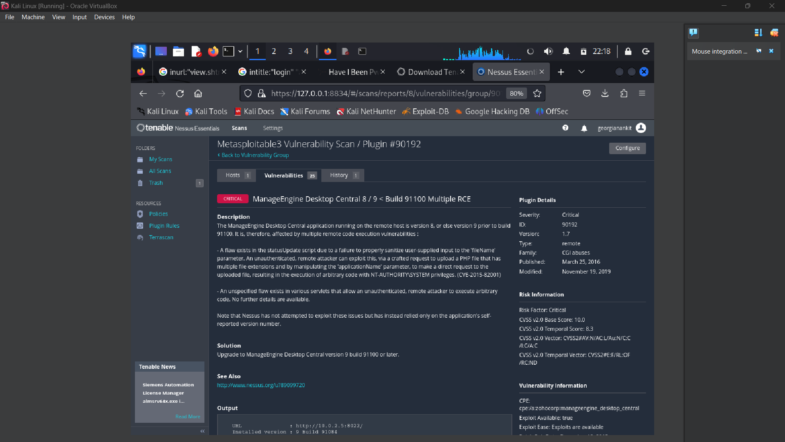

# ManageEngine Desktop Central 8 / 9 - Multiple Remote Code Execution Mitigation

## Vulnerability ID: `90192`
- **Severity**: Critical
- **Affected System**: Metasploitable3
- **Description**: The vulnerability exists in the ManageEngine Desktop Central application running on remote hosts, due to multiple flaws in user-supplied input fields. An unauthenticated remote attacker can exploit these vulnerabilities by sending specially crafted requests to execute arbitrary code with NT-AUTHORITY\SYSTEM privileges.

## Mitigation Steps
1. **Upgrade ManageEngine**:
   - Upgrade to the latest stable version, which is not affected by these vulnerabilities (at least version `Build 91100`).
   - If an upgrade is not possible, consider applying patches or security fixes provided by the vendor.

2. **Disable Vulnerable Features**:
   - If upgrading is not feasible, disable vulnerable features such as file upload functionalities and remote administration options until the issue is resolved.

3. **Restrict Access to the Application**:
   - Limit access to the ManageEngine application to trusted internal IP addresses only.
   - Use network-level access controls (firewalls, VPNs) to ensure only trusted users can access the application.

4. **Implement Input Validation**:
   - Ensure that any user inputs (such as file names, parameters, and URLs) are validated before being processed by the application.

## Additional Recommendations
- Regularly monitor the application logs for suspicious activity or attempts to exploit the vulnerable inputs.
- Isolate critical servers like ManageEngine on separate network segments.

**Screenshot**:  

