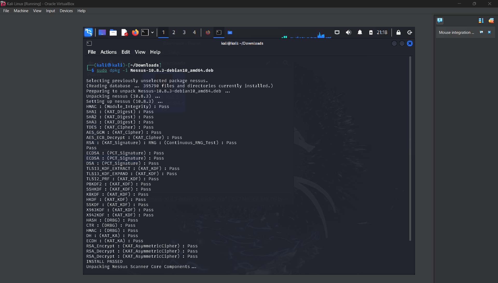
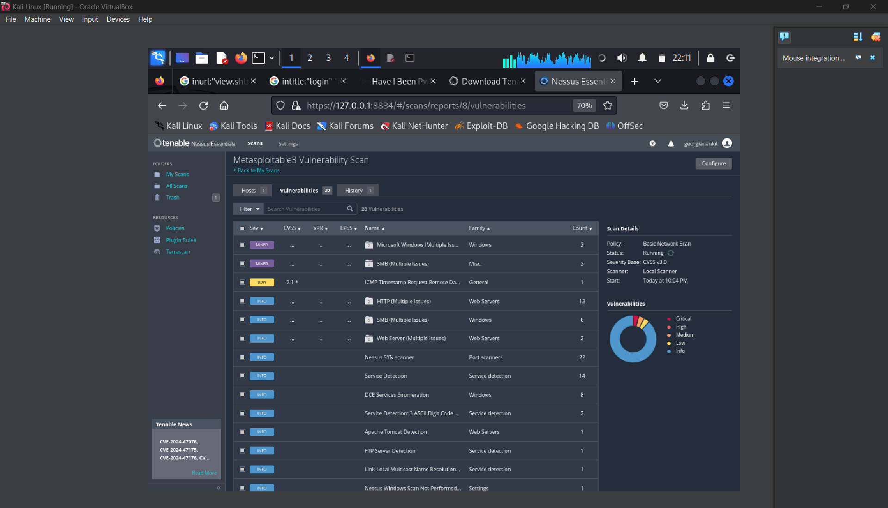
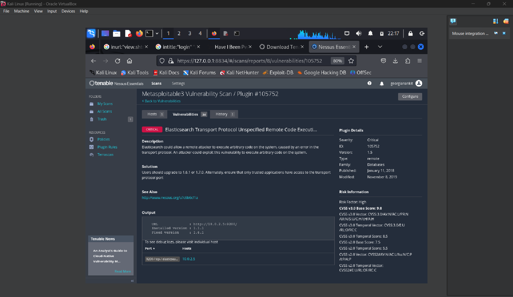
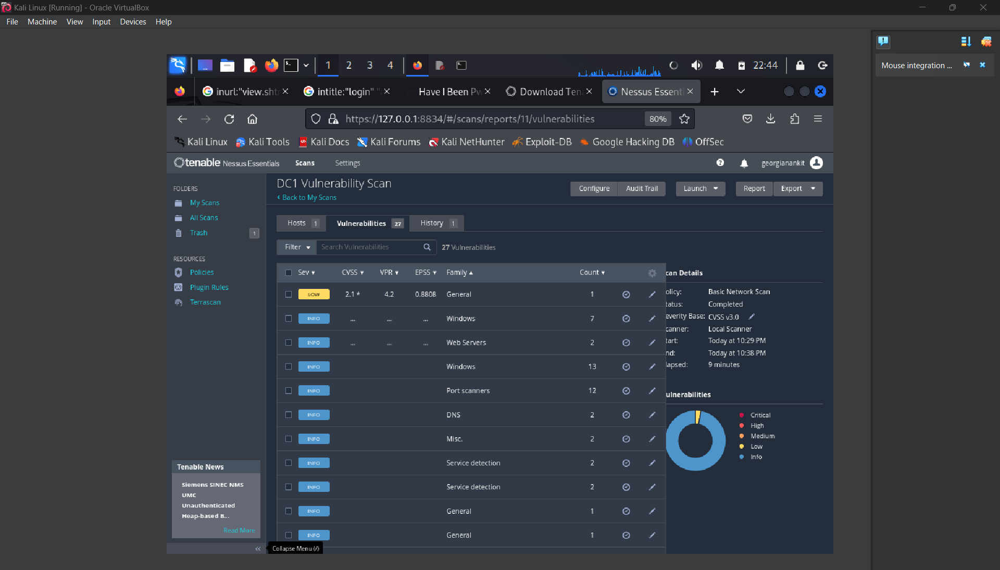
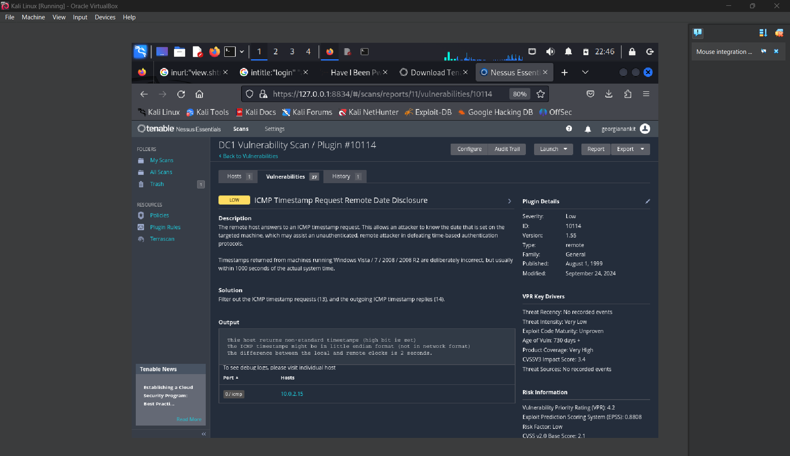
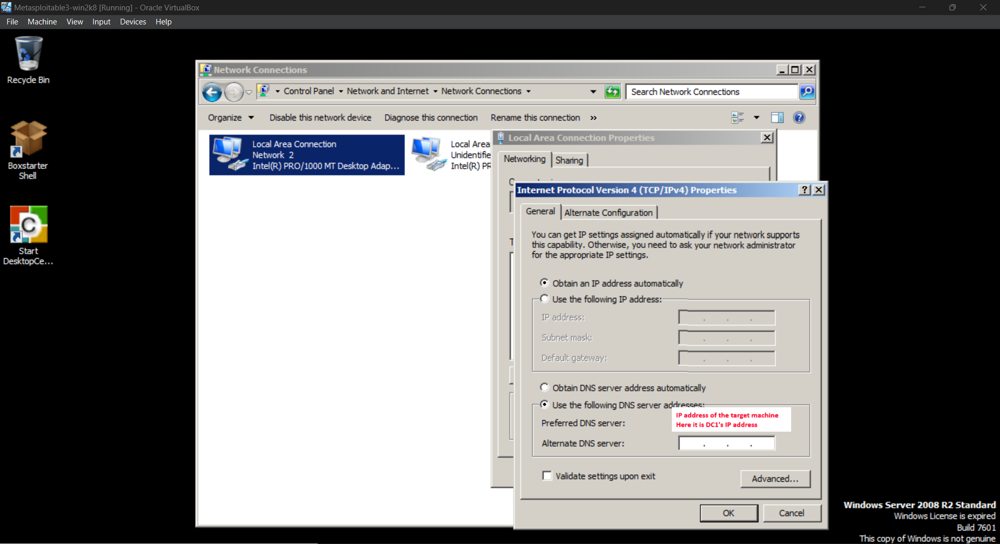
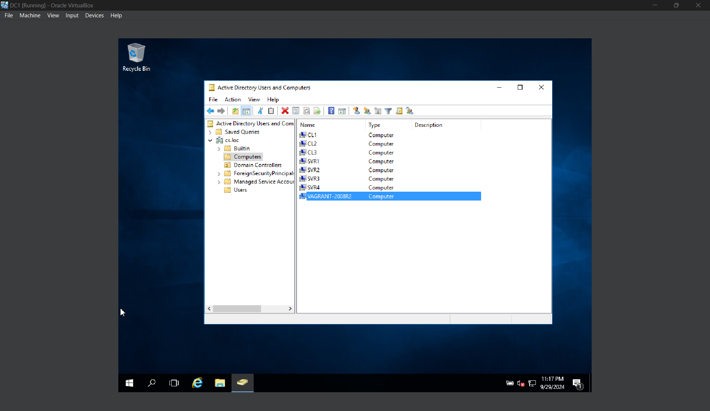
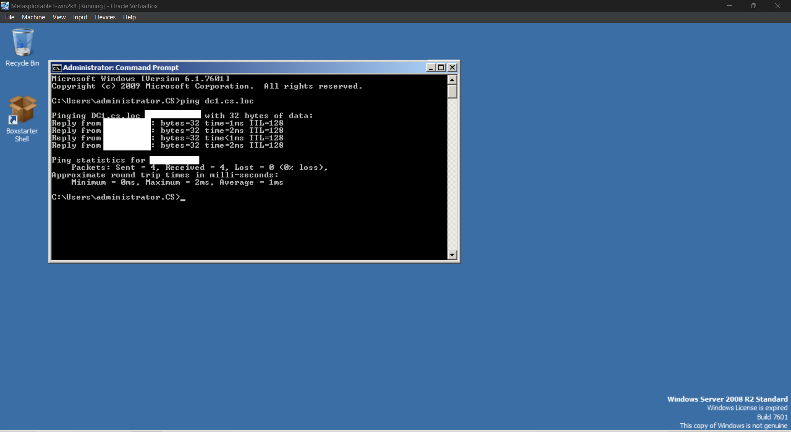

# Active-Directory-Vulnerability-Lab

## Introduction
This project demonstrates the integration of a vulnerable Metasploitable3 virtual machine into an Active Directory environment using a Domain Controller (DC). After successfully joining the machine to the domain, a vulnerability assessment was performed using Nessus Essentials. This repository documents the setup, identified vulnerabilities, and mitigation strategies.

### Key Tools Used
- **Nessus Essentials**: For vulnerability scanning and assessment.
- **Metasploitable3**: Vulnerable machine used for testing.
- **Windows Server 2008 R2**: Configured as the Domain Controller (DC).
- **Active Directory**: Centralized domain management.
- **Kali Linux**: Primary machine for running scans and other penetration testing tools.

## Project Setup

### 1. Environment Configuration
- **Domain Controller Setup**:
  - Windows Server 2008 R2 configured as the main DC with the domain `cs.loc`.
  - Metasploitable3 configured to join the Active Directory domain.
- **Network Configuration**:
  - Metasploitable3 was set up with the DC's IP address as the primary DNS server.

## Nessus Vulnerability Assessment

### 2. Nessus Installation
- Nessus Essentials was installed on the Kali Linux machine and configured to run vulnerability scans on the Metasploitable3 and DC1 machines.
- Basic setup steps and configurations were performed to ensure successful scan initiation.

  **Screenshot:**
  

### 3. Vulnerability Scan Results
- **Metasploitable3**:
  - 20 vulnerabilities identified.
  - Critical issues include Elasticsearch RCE and ManageEngine RCE.
  
  **Screenshots:**
  
  
  

- **Domain Controller (DC1)**:
  - Low and Medium vulnerabilities identified.
  - ICMP Timestamp Vulnerability was the primary low-severity finding.

  **Screenshots:**
  
  

## Mitigation Strategies

### Elasticsearch RCE Mitigation
This vulnerability allows a remote attacker to execute arbitrary code. The issue can be mitigated by upgrading to a secure version and restricting port access.

  **Detailed Mitigation**:  
  [Elasticsearch Mitigation](Elasticsearch_Mitigation.md)

### ManageEngine RCE Mitigation
This vulnerability allows arbitrary file upload and remote code execution on the server. The issue can be mitigated by upgrading the software and disabling vulnerable features.

  **Detailed Mitigation**:  
  [ManageEngine Mitigation](ManageEngine_Mitigation.md)

### ICMP Timestamp Disclosure Mitigation
This vulnerability exposes the timestamp of the system, which can aid in certain attacks. The issue can be mitigated by disabling ICMP timestamp responses on both Windows and Linux.

  **Detailed Mitigation**:  
  [ICMP Timestamp Mitigation](ICMP_Timestamp_Mitigation.md)

## Active Directory Integration

### AD Configuration
The Metasploitable3 machine was successfully integrated into the `cs.loc` domain.

**Screenshot:**

### User and Computer Management
The following computers and users were added to the Active Directory.

**Screenshot:**

## Connection Validation Between Metasploitable3 and DC1
The screenshot below shows the successful ping from Metasploitable3 to the Domain Controller (DC1), confirming network connectivity.

## Conclusion
This project successfully integrated a vulnerable machine into an Active Directory environment and demonstrated how to identify and mitigate vulnerabilities using Nessus Essentials. Through this project, a clearer understanding of Active Directory integration and vulnerability management was achieved.
